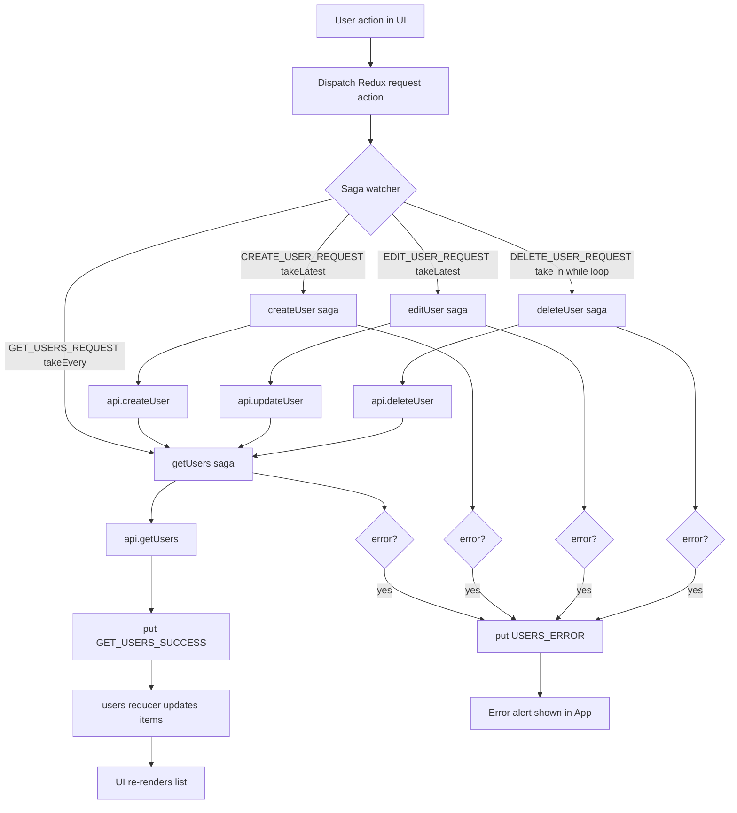

# users-on-saga
Thats a reusable CRUD for developer who needs async operations controlled by the pair Redux and Sagas. It works with React working in Vite with HMR and some ESLint rules. 

## Project Goal

This repository demonstrates a reusable User CRUD with a classic React + Redux + Redux-Saga architecture.

The main idea is educational and practical:
- Show that a clean async CRUD can be built in a "no-magic" style.
- Keep the code understandable for junior and mid-level developers.
- Emphasize explicit state transitions and side-effect orchestration.

## Why This Stack (Classic Versions)

This project intentionally uses older, battle-tested versions:
- React 16.5.2
- Redux 4.x
- Redux-Saga 0.16.x
- Reactstrap 6.x

Why this choice:
- It highlights foundational concepts without relying on modern abstractions.
- It demonstrates class-based React patterns that are still found in legacy codebases.
- It makes saga effects (call, put, takeEvery, takeLatest, take, fork) very explicit.
- It is useful for developers who need to maintain or migrate older projects.

## Architecture Overview

- UI components dispatch actions.
- Sagas listen for request actions and handle async API calls.
- Sagas dispatch success/error actions.
- Reducers store users and errors in Redux state.
- UI re-renders from the updated store.

Key files:
- src/actions/users.js
- src/sagas/users.js
- src/api/users.js
- src/reducers/users.js
- src/components/App.jsx
- src/components/UsersList.jsx
- db.json

## Async Flow With Redux-Saga

Mermaid is used below to make the async lifecycle easier to follow.
Reference: https://mermaid.ai/open-source/intro/getting-started.html



## Data Layer (json-server)

The project uses a local JSON database:
- db.json is the source of truth for users.
- json-server exposes REST endpoints on port 3004.
- Axios uses this base URL to perform CRUD operations.

Endpoints used by the app:
- GET /users
- POST /users
- PUT /users/:id
- DELETE /users/:id

## Run The Project

You must run frontend and fake backend in parallel.

1. Install dependencies

```bash
yarn
```

2. Start json-server (terminal 1)

```bash
yarn connectToDatabase
```

3. Start Vite app (terminal 2)

```bash
yarn dev
```

4. Open the local URL shown by Vite in your terminal.

## Who This Is For

- Junior developers learning Redux-Saga fundamentals.
- Mid-level developers reviewing explicit async architecture.
- Teams maintaining legacy React/Redux applications.

## Final Notes

This is a deliberate, purist-style CRUD example:
- Class-based React components.
- Explicit Redux action/reducer contracts.
- Side effects isolated in sagas.

If you can read this project end-to-end, you can confidently reason about async flow in many real-world codebases.

